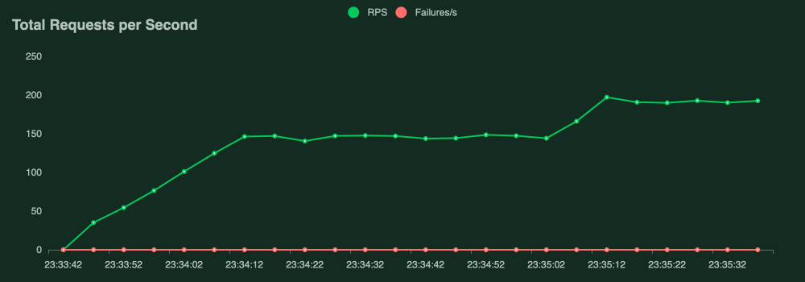
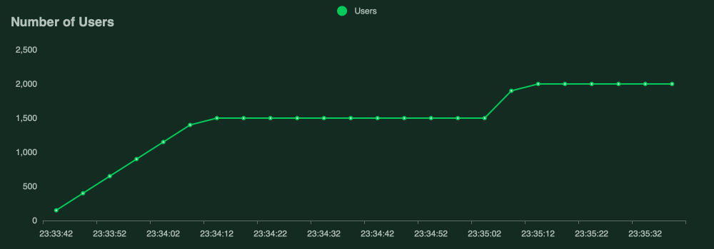

# AWS EC2 Cluster Demo

## Description

This is a demo of how to create a cluster of EC2 instances under a load balancer using AWS Elastic Beanstalk. The cluster is created using a single configuration file, `beanstalk.yml`, which is a YAML file that describes the cluster configuration. The configuration file is used by the `eb` command line tool to create the cluster.

## Load Tests Results

The following are the results of the load tests performed on the cluster. The load tests were performed using [Locust](https://locust.io/), a load testing tool written in Python.

It uses one of the smallest EC2 instances, `t2.micro`, to run the load tests. The load tests were performed  with 2000 concurrent users. Each user was making a request in 5-15 seconds interval, to a product page, with data loaded from DynamoDB.
There wasn't any cache used in the application. The application was able to handle the load without any errors.

- **Request Per Seconds**: 190-200
- **Failure Rate**: 0%
- **Concurrent Users**: 2000

With RPS 190-200, the application expected to handle a website with up to **1.6 million visitors per day**. (Assuming 10 requests per visitor per day)

_1685606488.png)

[Interactive charts and full report](report_1685565337.488435.html)

## Deployment

- eb create --sample ec2-scale-demo
- eb deploy
- eb open

## Cleanup

- eb terminate ec2-scale-demo